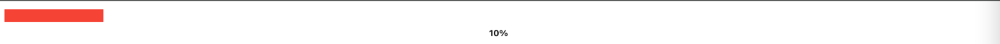
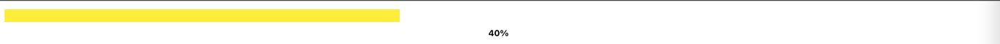
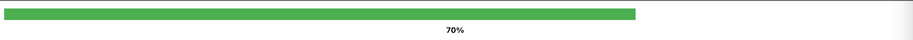

# vaadin-custom-component
## Rating Components
### Star rating


The StarRating component is a highly configurable star rating system for Vaadin applications. It allows users to select a rating by clicking on stars. This component is designed to be flexible with options to set the number of stars, star size, colors, and the initial rating.
#### Features
* **Star Rating**: Select a rating by clicking on the stars.
* **Flexible Configuration**: Customize the number of stars, star size, colors, and initial rating.
* **Dynamic Updates**: Stars update based on the current rating.

#### Usages
##### Creating the Component
```java
// Create a StarRating component with default settings
StarRating starRating = new StarRating();

// Create a StarRating component with 10 stars, 40px size, and custom colors
StarRating customStarRating = new StarRating(10, "40px", "blue", "lightgray");

// Create a StarRating component with an initial rating of 3 stars
StarRating initialRating = new StarRating(5, "32px", "gold", "gray", 3.0);
```

##### Configuring the Component
You can customize the component's properties after creation:
```java
StarRating starRating = new StarRating();

// Change the color of the active stars
starRating.setActiveColor("red");

// Change the color of the inactive stars
starRating.setInactiveColor("lightgray");

// Change the size of the stars
starRating.setStarSize("24px");

// Change the total number of stars
starRating.setTotalStars(7);
```

## Progress Components
### Progress bar with label




The ProgressBarWithLabel is a custom Vaadin component that visually represents a progress bar with an optional label displaying the progress percentage or custom text. The color of the progress bar changes dynamically based on the current progress value, providing a visual indication of the progress status.
#### Features
* **Dynamic Progress Display**: The progress bar visually reflects the current progress, which can be set between 0% and 100%.
* **Color Change Based on Progress**:
  * Red for 0% to 33% progress.
  * Yellow for 33% to 66% progress.
  * Green for 66% to 100% progress.
* **Customizable Label**: You can display a percentage or set a custom label inside the progress bar.
* **Smooth Animations**: The progress bar transitions smoothly when updating the width and color.

#### Usage
##### Basic Setup
To use the ProgressBarWithLabel component in your Vaadin application, first, include it in your view:

```java
ProgressBarWithLabel progressBar = new ProgressBarWithLabel();
progressBar.setWidth("100%"); // Set the progress bar to be full-width
```
##### Setting the Progress
You can set the progress value using the setProgress(double progress) method. The progress value should be between 0.0 (0%) and 1.0 (100%):
```java
progressBar.setProgress(0.5); // Set progress to 50%
```
##### Customizing the Label
To customize the label displayed inside the progress bar, use the setLabel(String label) method:
```java

progressBar.setLabel("Loading..."); // Set a custom label
```
##### Dynamic Color Changes
The color of the progress bar will automatically adjust based on the progress value:
* Red for 0% to 33% progress.
* Yellow for 33% to 66% progress.
* Green for 66% to 100% progress.